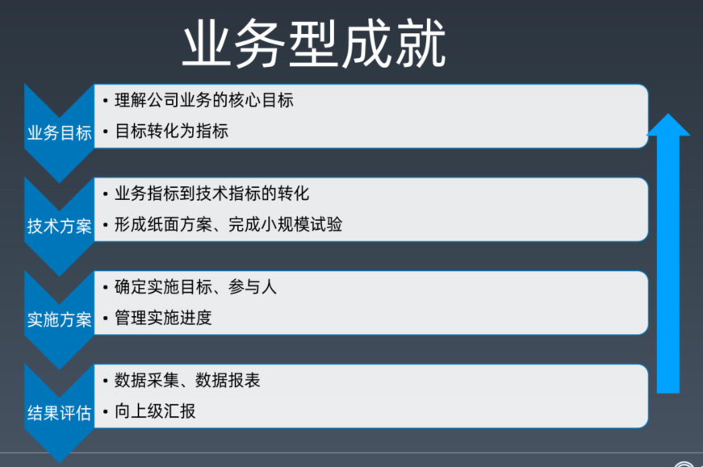
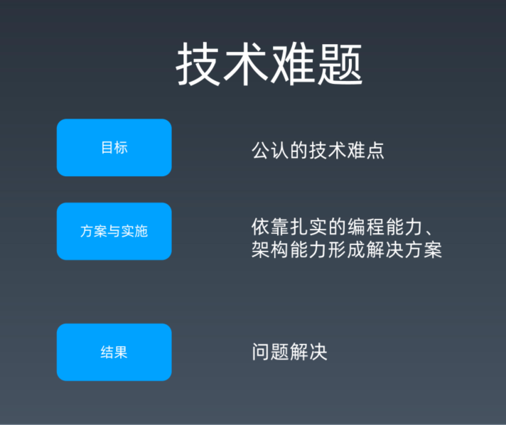
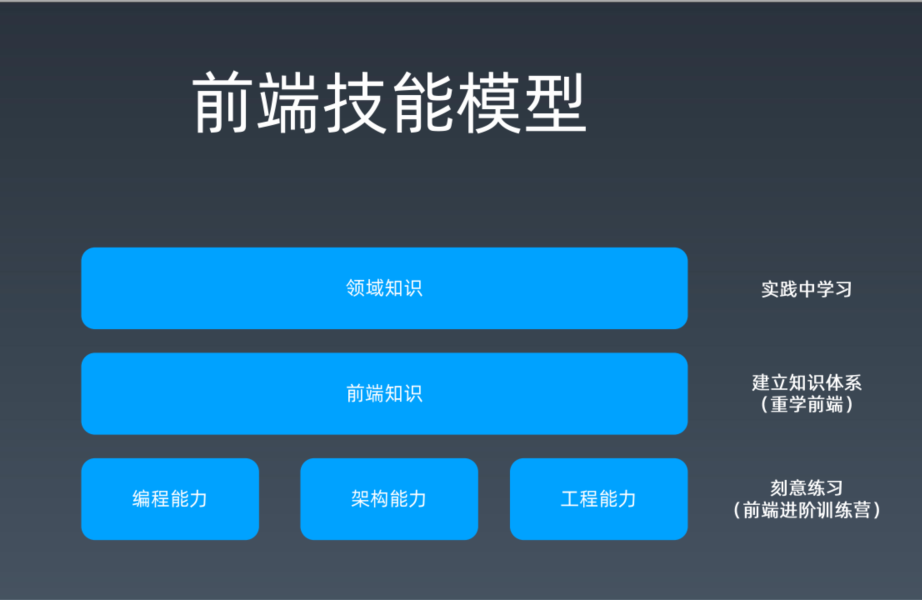
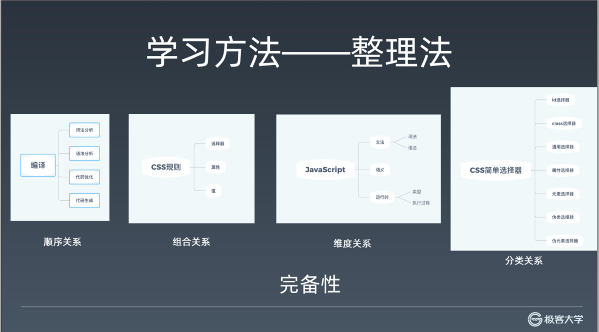
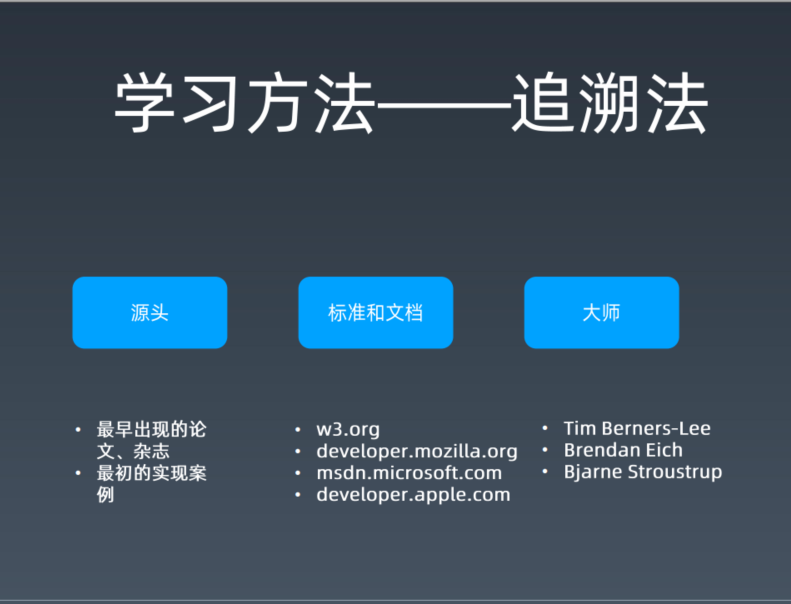

<!-- TOC -->

- [学习方法与构建知识体系，工程体系](#学习方法与构建知识体系工程体系)
  - [优秀的工程师](#优秀的工程师)
  - [职业发展的路线](#职业发展的路线)
    - [成就](#成就)
  - [前端进阶之路](#前端进阶之路)
    - [前端技术模型](#前端技术模型)
  - [学习方法](#学习方法)
    - [整理法](#整理法)
    - [追溯法](#追溯法)
  - [书籍](#书籍)

<!-- /TOC -->

# 学习方法与构建知识体系，工程体系

**you** are the ower of your career

职业规划很重要，基础知识是基本。

新人多去大公司历练历练

**前端技术不是武林秘籍，**
**真正的能力是练出来的！**

面试的时候遇到难题可以将自己的分析思路

课程的最后，能够自己全部完成一个前端知识图谱

## 优秀的工程师

- 领域知识
- 高潜力
- 好的职业规划(工程师-》资深工程师-》专家-》经理)

**必须要有明确的职业规划！！！**

**首先就是规划自己（管理or技术，how），然后才是能力的成长。**

## 职业发展的路线

螺旋上升： 成长=》成就=》晋升=》成长

晋升可以是达到一个理想的岗位，然后接触更多的资源，更多的项目，然后就可以带来成长。

### 成就

- 业务型成就:   
  
  理解公司的核心业务目标。
  懂业务，做业务，并把公司业务落到技术方案上面去。

- 工程型成就   
  

- 技术难题   
  

## 前端进阶之路

### 前端技术模型

## 学习方法

### 整理法

寻求知识的完备性

### 追溯法

寻求知识的准确性,遇到不懂的概念，最好就是利用追溯法去学习。

## 书籍

- 《面向对象分析与设计》
- 《算法》
- 《数据结构》
- 《操作系统》
- 《计算机网络》
- 《计算机原理》

