<!-- TOC -->

- [JavaScript](#javascript)
  - [预习部分](#预习部分)
  - [范用语言分类方法](#范用语言分类方法)
  - [产生式（BNF）](#产生式bnf)
  - [深入理解产生式](#深入理解产生式)
  - [现代编程语言的分类](#现代编程语言的分类)
  - [编程语言的性质](#编程语言的性质)
    - [图灵完备性](#图灵完备性)
    - [动态和静态](#动态和静态)
    - [类型系统](#类型系统)
  - [一般命令式编程语言](#一般命令式编程语言)
  - [Number](#number)
    - [js中的原子：](#js中的原子)
    - [number的双精度表示](#number的双精度表示)
    - [语法：](#语法)
  - [string](#string)
    - [编码集/字符集](#编码集字符集)
    - [编码方式-encoding](#编码方式-encoding)
  - [null 和 undefined](#null-和-undefined)
  - [对象的基础知识](#对象的基础知识)
    - [js中的原型：](#js中的原型)
    - [对象的正确书写](#对象的正确书写)
  - [js中的对象](#js中的对象)
    - [属性：](#属性)
    - [语法](#语法-1)
    - [函数对象](#函数对象)
    - [其他特殊的对象](#其他特殊的对象)
    - [宿主对象](#宿主对象)

<!-- /TOC -->

# JavaScript

## 预习部分

- [重学前端——开篇](https://www.yuque.com/docs/share/75aaf897-08d2-4c7b-8435-b96c994441b3?#《开篇》)


## 范用语言分类方法

- 非形式语言:语法没有形式化的规定，没有严格的定义
  - 中文，英文

- 形式语言：有形式化的定义，非常的严谨严格


形式语言的分类，有很多种，主要介绍乔姆斯基谱系：
- 0型 无限制文法：怎么写都ok
- 1型 上下文相关文法：根据前后来判断每一个符号所表达的意义
- 2型 上下文无关文法:同样的表达放在哪里都是一样的
- 3型 正则文法：所有能被正则表达式直接去描述的文法
  
1-3型文法是上下包含关系，一个上下文相关文法一定属于0型，反过来就不一样，
3型都属于前面的类型，但是反过来也不一样。


## 产生式（BNF）

产生式有多种描述方法，这里介绍一种最经典、最常用的描述方法：巴科斯-诺尔范式，简称BNF。   
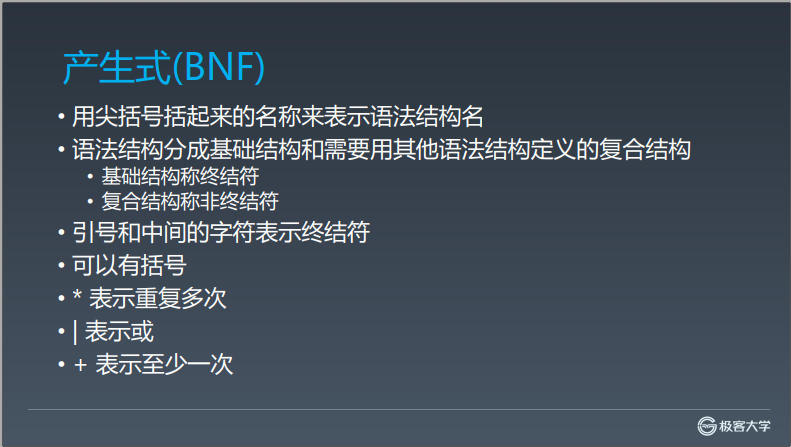   

实际上，产生式有很多种，不同的文档里面也会选用不同的产生式的方式，但是他们的大体结构和表达的能力是非常相近的。

终结符不是程序终结的意思，<EOF>，类似叶子节点的意思。

一个语言会有很多终结符，终结符通过组合关系形成非终结符

> 每条规则的左部是一个非终结符
> 右部是由非终结符和终结符组成的一个字符串，左部和右部以 ::= 分开
> 具有相同左部的规则可以共用一个右部，各右部之间以竖线 | 隔开
> ::= 是 被定义为 的意识 
> ——[BNF百度百科](https://baike.baidu.com/item/%E5%B7%B4%E7%A7%91%E6%96%AF%E8%8C%83%E5%BC%8F/1849549?fromtitle=BNF&fromid=7328753&fr=aladdin)

- [《重学前端——编译原理实现》](https://www.yuque.com/docs/share/f1ae56fd-9fbd-440b-852c-76f48b0bedce?#《理解编译原理》)


## 深入理解产生式
根据文法的复杂程度进行分类：
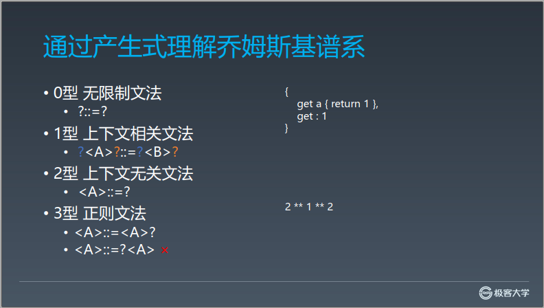

- 1型：左右两边都可以写多个非终结符，但是变化的只能有一个，一定有固定不变的部分
- 2型：左边只能有一个非终结符，右边随便写
- 3型：递归定义的时候，左边的非终结符不能出现在右部的末尾

js虽然总体上属于上下文无关文法，其中的表达式部分大部分属于正则文法，但是有两个特例： 
- ** 运算，右结合
- if等语句也不是正则文法

但是，js也不是一个严格意义上的上下文无关文法，因为
```js

{
    get a() { return 1 };
    get: 1
}

```
中的get结合上下文，代表不同的意思.

所以如果严格按照乔姆斯基谱系来理解的话，js是属于上下文相关文法。

在js的引擎的实现上，它的总体的编程结构都是针对上下文无关文法进行分析，而遇到get这种特例，就做一些特例处理。所以一般来说，**也不会把js归结为上下文相关文法去处理。**

每一个语言的标准里面，都会自己定义一个产生式的书写方式，只学一个BNF是没有办法读懂所有的语言的，但是只要理解了产生式背后的思路和原理，一切都不是问题。


## 现代编程语言的分类

可以认为大部分编程语言的主体都是上下文无关文法。

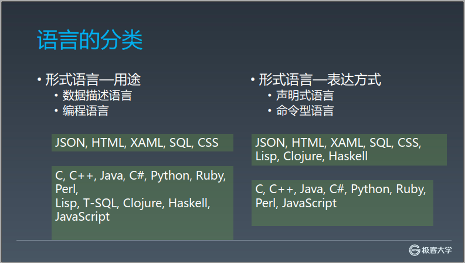

## 编程语言的性质

### 图灵完备性   

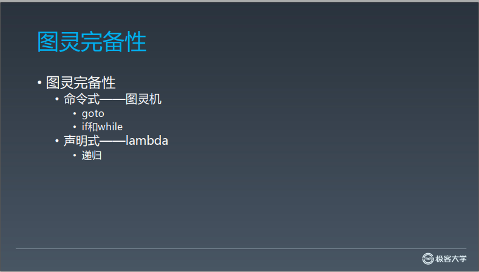

所有的编程语言必备的一个条件：图灵完备性
所有的可计算的问题都可用来描述的语言，就具备图灵完备性

### 动态和静态

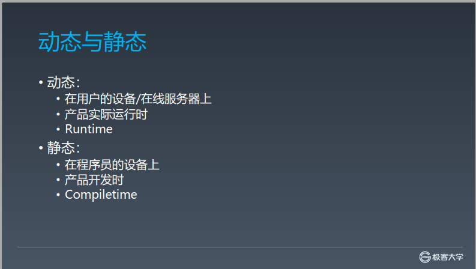


### 类型系统
类型系统其实是非常复杂的

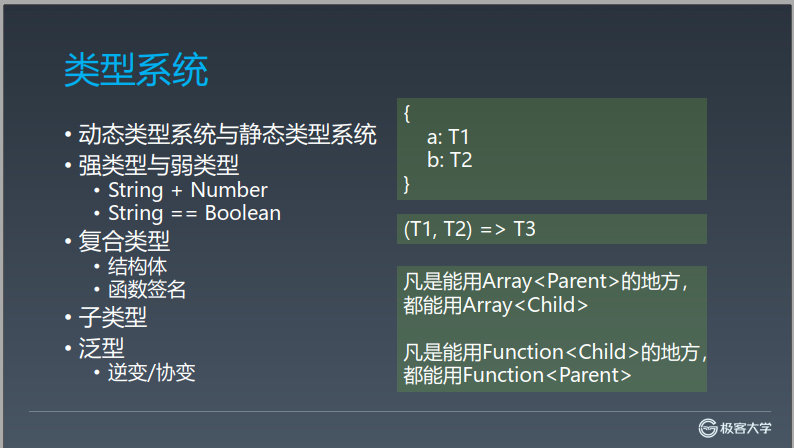

静态类型系统：c++（最终编译到目标机子的代码的时候，所有的类型信息都被丢掉了）
动态类型系统：JavaScript
半静态半动态系统：java（反射机制）

区分动态和静态，最简单的方法，就是它在谁的电脑上能够保留下来

## 一般命令式编程语言

总体上来讲，命令式编程语言的结构会分成下面5个层级
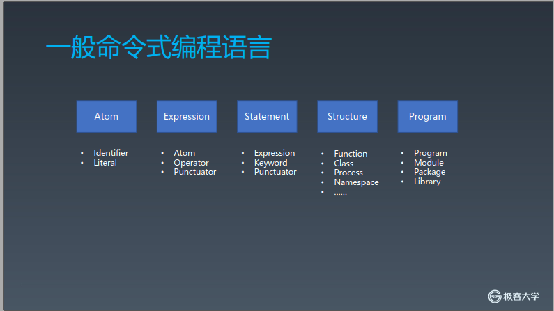

原子--》表达式---》语句---》结构化---》程序

在js中，管理其他模块的安装和使用：npm

js本身也有两个最顶级的定义：
- program：实际执行的代码
- module：准备好被复用的模块
两者在js里是有严格的区分的


连接语法和运行时的正是语义，
用一定的词法和语法，表达一定语义，从而操作运行时，这就是编程。

## Number

### js中的原子：

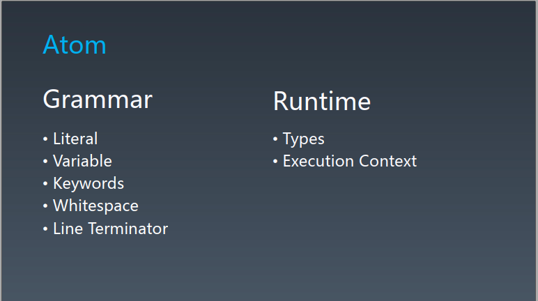

js中类型：
- number
- string
- boolean
- object
- null
- undefined
- symbol
- 以及仍在制作途中的biglnt类型

### number的双精度表示
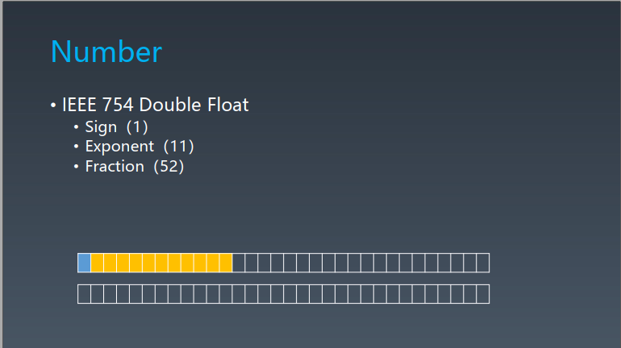

### 语法：
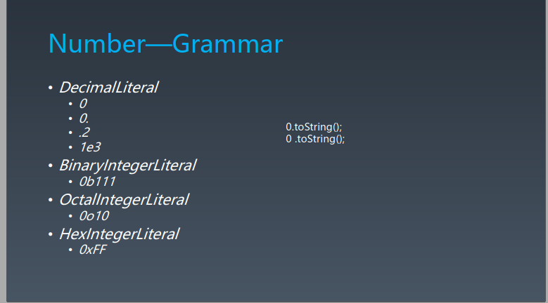

`0.toString()`会报错，应该写成`0 .toString()`,前面的`0.`会被解析成0

`0.1 + 0.2 == 0.3`是false，因为发生了3次精度缺失，
操作数转成二进制，缺失
相加，缺失
结果数转成十进制，缺失

正确的判断应该使用`Math.abs(0.1 + 0.2 - 0.3) <= Number.EPSILON`,检查等式左右两边差的绝对值是否小于最小精度，才是正确的比较浮点数的方法

## string

- string：是一串的意思，比如中国古代里面的一串铜钱
- character：就是一个个的字符，字符是一个抽象的表达，需要结合字体才会变成一个可见的形象
- code point：码点，计算机中用来表示character的东西，说来简单，就是一个数组，比如在97表示a
- encoding：编码方式，这个字存几个字节，字节里面是什么格式

计算机里面，存储的基本单位是字节。

### 编码集/字符集
- ASCII：常用的127个字符，没有办法表示中文
- Unicode：包含全世界的各种字符
- UCS:0000-FFFF.
- GB：国标,同一个字符的码点和Unicode的码点不一定相同
  - BG2312
  - GBK（GB13000）
  - GB18030
- ISO-8859：东欧
- BIG5：台湾

以上都会兼容ASCII码。

### 编码方式-encoding
utf-8,默认用一个字节表示一个字符
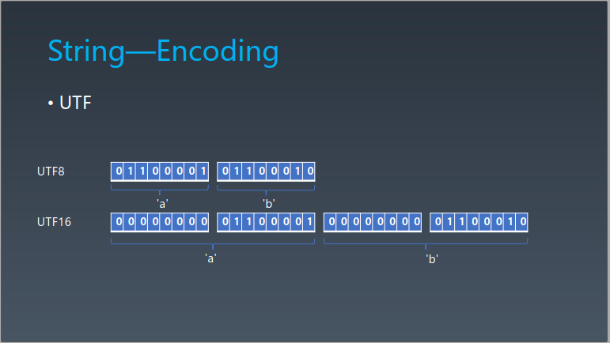

匹配单引号和双引号的字符串写法：
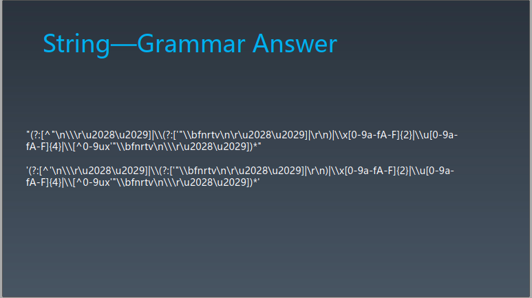

反引号的编译时的语法结构:
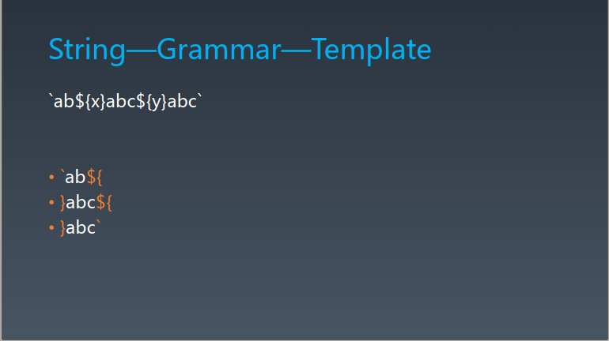
分成四个部分：除了上图所示的三个部分，还有就是纯粹的字符串，没有变量


## null 和 undefined

null表示空值，空对象指针，undefined表示未定义

undefined是全局变量，可修改，所以一般用`void 0`来产生 undefined

symbol也只有作为object的一个属性名这样的一种用途

## 对象的基础知识

任何对象都是唯一的。内存地址的唯一性来表示对象的唯一性

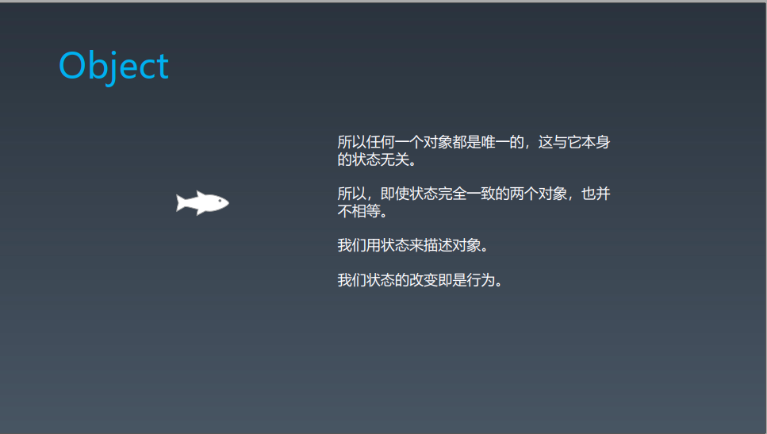

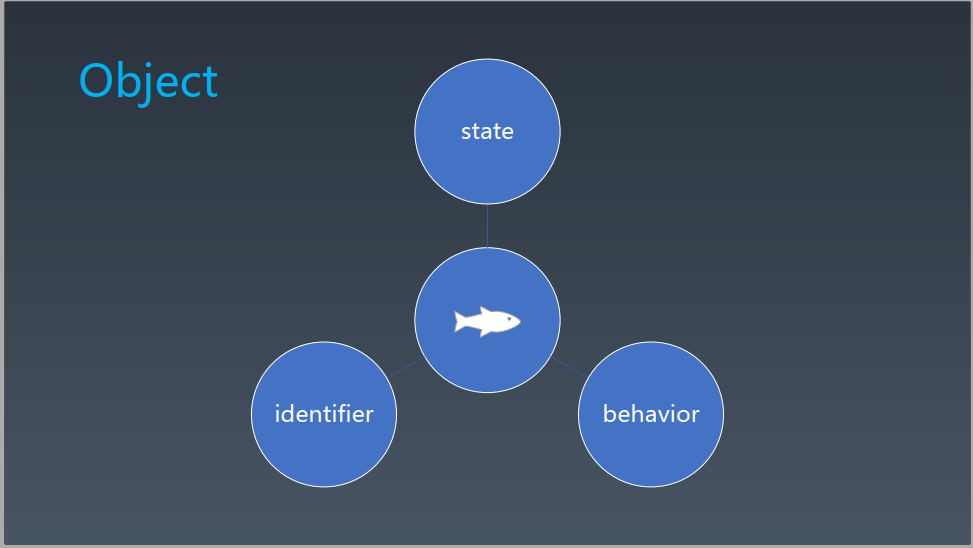

### js中的原型：
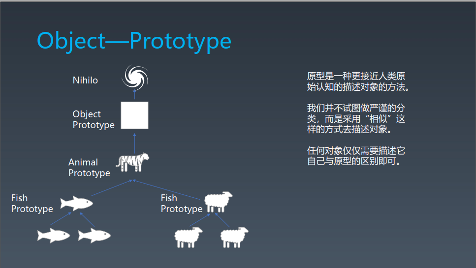

nihilo：虚无虚空 

凡是使用`[[ ]]`括起来的属性，都属于内置的属性或行为，在js代码中是无法访问到的，但是在运行时中又确实存在，也可以借助宿主环境提供的api去调用。比如大多数现代浏览器提供了一个名为 __proto__ （前后各有2个下划线）的属性，其包含了对象的原型。[prototype和__proto__的区别](https://www.jianshu.com/p/3d756c5bba16)

**最顶层的原型是null**

```js
const obj={name：'dog'};

console.log( obj.__proto__.__proto__ ) // null,

```


### 对象的正确书写

如果描述狗咬人？
没错，我的第一想法就是下面这样：
```js
class Dog{
    bite(human){
        //...
    }
}
```
但是,这是错误的！！！
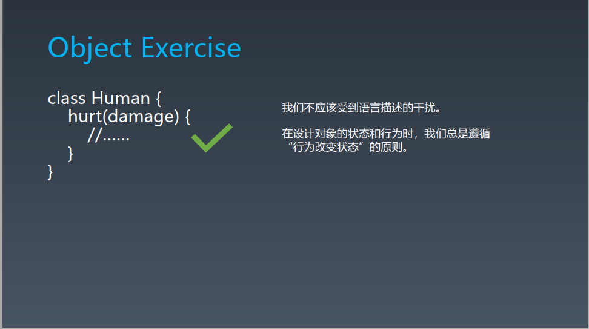

**在设计对象的状态和行为时，我们总是遵循“行为改变状态”的原则**

## js中的对象

js中属性既可以描述状态，也可以描述行为
大部分编程语言都是用内存地址的唯一性来表示对象的唯一性


### 属性：
js对象中的属性都是key-value对，键值对。可以根据可以找到value
key可以是字符串类型，也可以是symbol类型。symbol在内存中建立之后，只能通过变量去引用它。所以symbol很好地实现了属性访问的权限控制，不把symbol的名字保留出去，别人是无法知道的其对应的属性值是什么的
value可以是数据属性，也可以是访问器属性
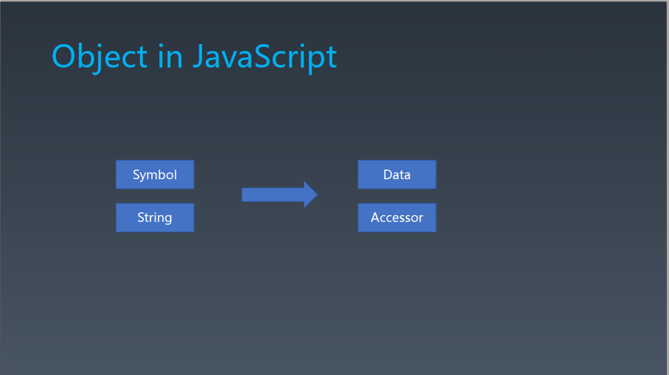

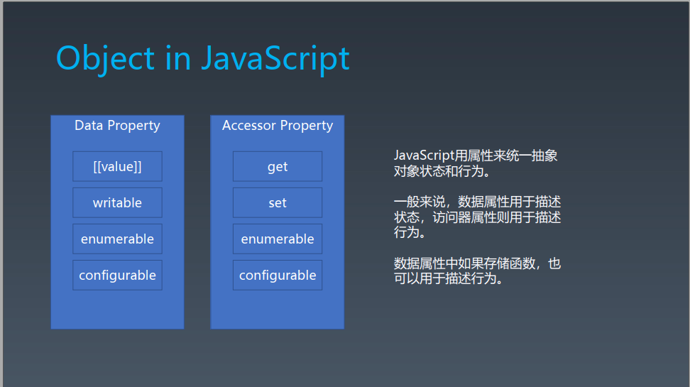


### 语法

推荐前3种：
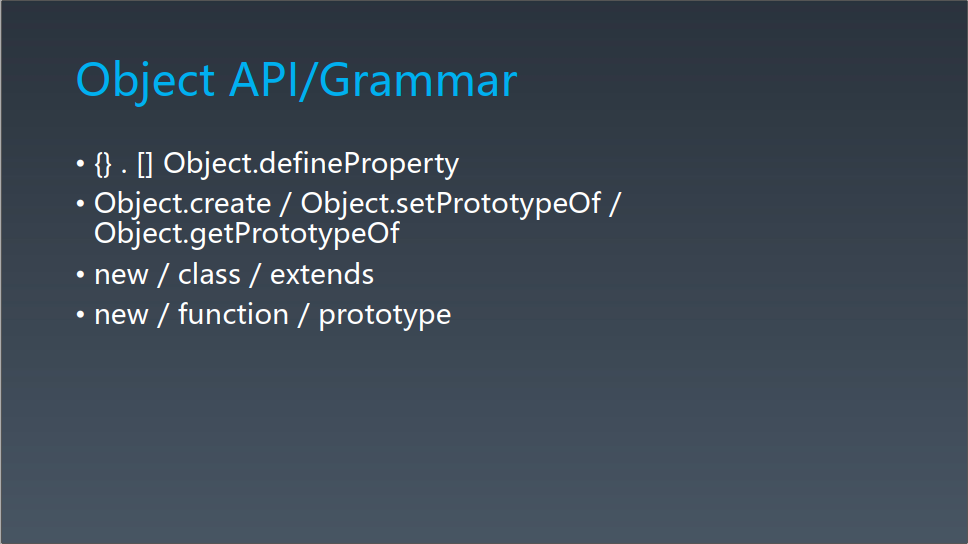


### 函数对象


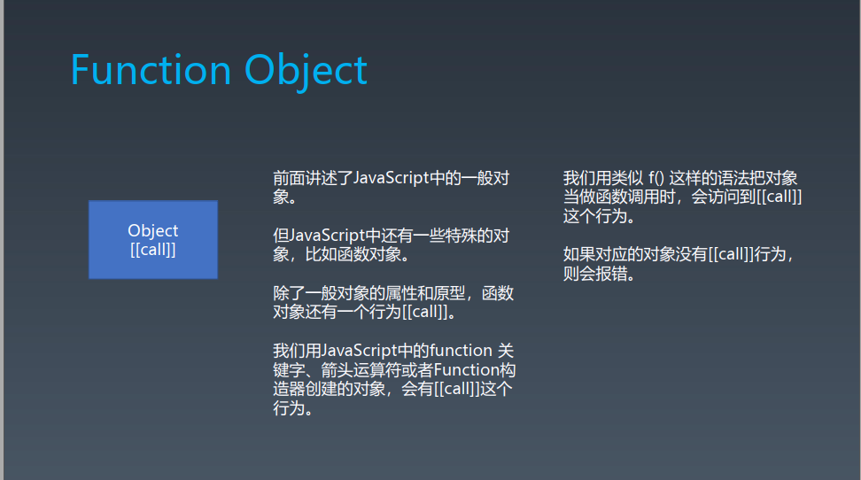

### 其他特殊的对象

数组对象的长度，还有原型中的setPrototypeOf：
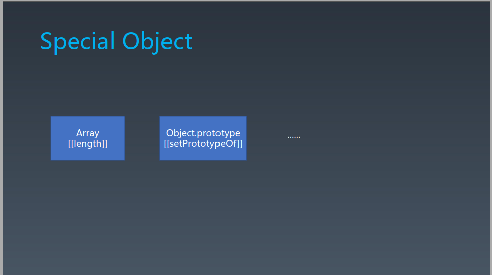

### 宿主对象

js语言中没有定义，而是由js的宿主环境去定义的，比如
在浏览器中能访问到的window对象，settimeout等

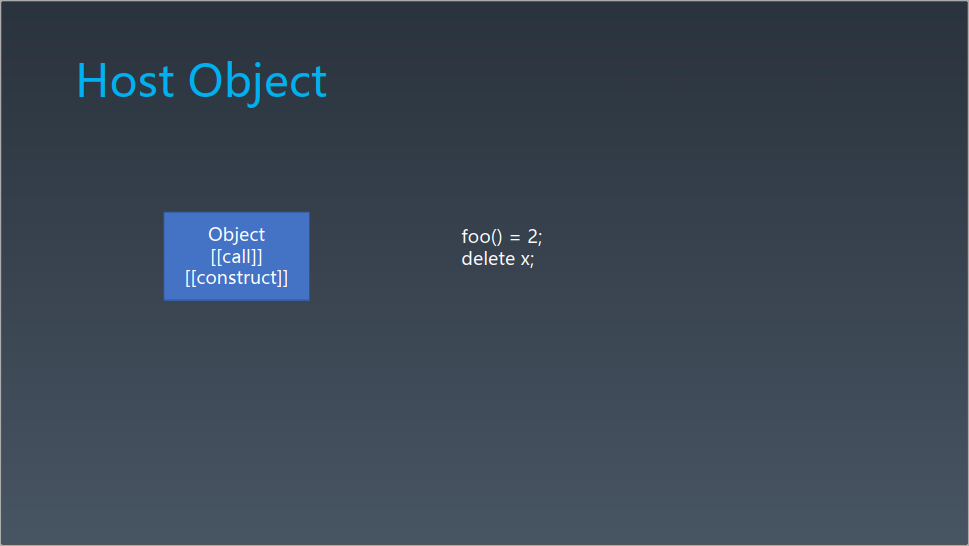


